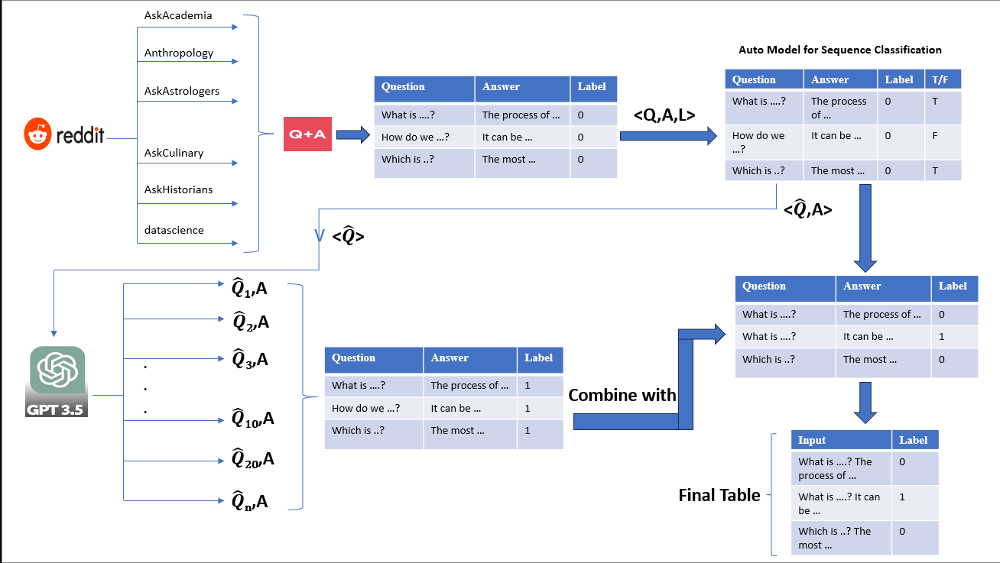
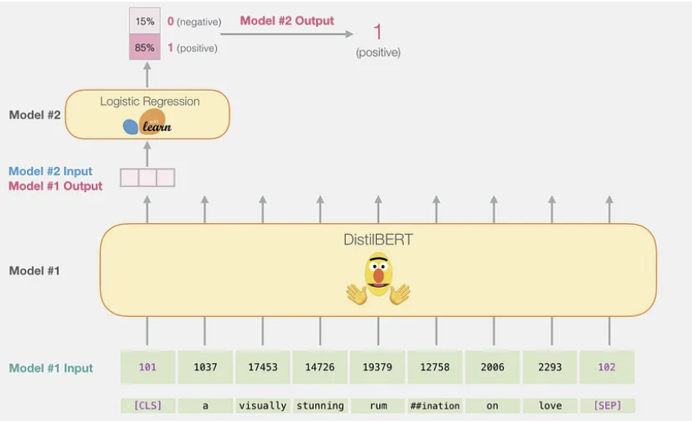

# Classifying-Human-and-ChatGPT-generated-answers-using-Bert

## Overview
This project aims to differentiate between human-generated and GPT-generated answers to questions posted on various Reddit subreddits. The increasing use of GPT for generating content has presented challenges in distinguishing authentic student submissions from those generated by AI on platforms like Canvas. Our solution leverages BERT models for classification and Huggingface's AutoModelForSequenceClassification to identify questions in subreddit posts.

## Repository Structure
- `Bert_Text_Classifier_with_Dropout.ipynb`: Jupyter notebook containing the BERT classifier with dropout implemented. This model is fine-tuned to classify text as either human-generated or GPT-generated.
- `Bert_Text_Classifier_without_Regularization.ipynb`: Jupyter notebook for the BERT classifier without regularization. It serves the same purpose but is a variation without dropout to compare model performances.
- `final.csv`: The dataset comprising question-answer pairs from Reddit, with labels indicating whether the answer was generated by a human or GPT.
- `PromtGenFromOpenAIAPI.ipynb`: Notebook detailing the process of using the OpenAI API to generate GPT-3.5 prompts for questions obtained from Reddit.
- `question_validation.ipynb`: Contains the implementation of the Huggingface AutoModelForSequenceClassification to classify Reddit post titles as questions or statements.

## Data Collection Process

## BERT Model Architecture

## Data Collection
Data was collected from Reddit subreddits (r/AskAcademia, r/Anthropology, r/AskAstrologers, r/AskCulinary, r/AskHistorians, r/datascience), and GPT-3.5 was used to generate corresponding prompts for identified questions.

## Model Training
Two BERT-based classifiers were trained: one with and one without dropout. The dropout is used as a regularization technique to prevent overfitting.

## Usage
To use the classifiers, input a question-answer pair into the model. The output will be a label indicating whether the answer is likely to have been generated by a human or by GPT.

## Requirements
- Python 3.x
- Jupyter Notebook
- Huggingface Transformers
- PyTorch
- OpenAI API access

## Contact
For any queries related to this project, please reach out to [alusurigagandeep@gmail.com , akshaykumar6478@gmail.com, dsksrikumar@gmail.com,naveen.kumar.satya@gmail.com , shashank.gujja1999@gmail.com, kushalreddy1506@gmail.com].

